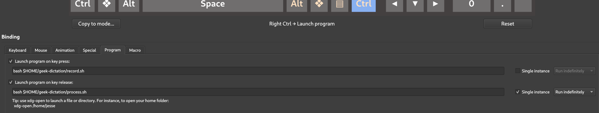

# geek-dictation

Inspired by [nerd-dictation](https://github.com/ideasman42/nerd-dictation), this is a hackable way to implement voice typing on linux. Instead of python, this implementation uses a set of bash scripts. It uses one of Open AI's [Whisper models](https://github.com/openai/whisper) that has been converted and optimized with [whisper.cpp](https://github.com/ggerganov/whisper.cpp). The model is run in server mode, then utilized with a curl command that sends it audio recorded with [pw-cat](https://www.systutorials.com/docs/linux/man/1-pw-cat/) (pipewire) using hotkeys programmed with [ckb-next](https://github.com/ckb-next/ckb-next). The text is typed with [dotool](https://sr.ht/~geb/dotool/) after it has been processed with custom SED commands (all in memory). A similar approach is [voice_typing](https://github.com/themanyone/voice_typing). The advantage with geek-dictation is speed, customization (with the SED commands), and the ability to pause as long as you want while recording your audio.

Note: [pw-cat/pw-record](https://www.systutorials.com/docs/linux/man/1-pw-cat/) is the key to making this work. The second script triggered by releasing the hotkey kills pw-rec and begins sending the resulting wave file to the Whisper model. Doing this with other recording options in linux, such as sox, results in deleting about two seconds from the end of the audio file. This can be fixed by adding a two-second delay in the script, but that defeats the goal of making the entire process fast. When pw-rec is killed, the entire audio file remains intact. I think this has something to do with pw-rec's lower latency recording.

## Dependencies
* whisper.cpp
* ffmpeg (might already be installed)
* dotool
* go programming language
* ckb-next
* a keyboard or mouse compatible with ckb-next
* pw-cat/pw-rec (likely already installed)
* curl (likely already installed)

## Getting Started
### Set up a GGML optimized whisper model.
The documentation in [whisper.cpp](https://github.com/ggerganov/whisper.cpp) is fairly straight forward. For a reasonably powerful desktop computer, I would recommend the english small model, which isn't actually that small (tiny and base are smaller). For a notebook computer or an older desktop, base or tiny is probably better.

The whisper.cpp documentation describes ways to further accelerate inference speed. Because I do not have a fancy GPU, I went with [openvino](https://github.com/openvinotoolkit/openvino). For those considering this approach, I have two thoughts. First, although openvino is an Intel project, it works just fine with AMD CPUs with an x86 architecture. Second, the version of openvino could matter. Through much trial and error, I learned that version 2023.0.0 (recommended by whisper.cpp) worked for my older Coffee Lake intel computer. However, I needed version 2023.2.0 for my newer Ryzen 9 7950X computer.

## Install ffmpeg if not already installed
ffmpeg is used to convert the recorded audio to a whisper compatible audio file (when starting the server, the -convert flag does this). Although the "record.sh" script uses pw-rec to record a wave file, the whisper model uses a very specific type of wave file.

Fedora/RHEL

	sudo dnf install ffmpeg
	
Ubuntu

	sudo apt install ffmpeg

### Get dotool working.
You will need an application that simulates keyboard input. Both [dotool](https://sr.ht/~geb/dotool/) and [ydotool](https://github.com/ReimuNotMoe/ydotool) work with [Wayland](https://wayland.freedesktop.org/), and either will work for this project. I prefer dotool because it seems much faster. In fact, I found it necessary to slow it down by five milliseconds to ensure accuracy (see process.sh). To get dotool working: 

* First install the go programming language if not already installed

Fedora/RHEL

	sudo dnf install golang

Ubuntu

	sudo apt install golang-go
	
* Install dotool by downloading source code from [here](https://git.sr.ht/~geb/dotool) and follow the instructions. The part about setting udevdm device rules is important (see more about that on the manpage). You can test to see if dotool is working with something like this:

	echo type hello | dotool
	
### Place Geek-Dication in Home folder
All of these instructions assume that geek-dication scripts are in your home folder. For a quick way to so this:

	git clone https://github.com/jessemcg/geek-dictation.git
	
Make sure the scripts are executable.

	sudo chmod +x /$HOME/geek-dictation/*.sh

### Program hotkeys with ckb-next
* Install [ckb-next](https://github.com/ckb-next/ckb-next), which is a GUI based app that allows the user to assign functionality to keys or buttons on supported Corsair keyboards or mice.

Fedora/RHEL

	sudo dnf install ckb-next
	
Ubuntu

	sudo apt install ckb-next
	
* Open ckb-next. Navigate to your keyboard and click on a key to use for general voicetyping. With the "Binding" dialogue open, choose the "Program" sub dialogue. Then type in the command for executing the "record.sh" script for the "on key press" option. Make sure the "Single release" option is unchecked. Then type in the command for executing the "process.sh" script for the "on key release" option. Make sure the "Single release" option is checked.

* For in-line voicetyping (like to edit just a few words), choose a different hotkey and follow the same steps. But for the "on key release" option, type in the command for executing the "process_quick_edit.sh" script. This ensures that the first word is not capitalized, and that there is no punctuation at the end.

* Add SED commands to the sed_commands.txt file to make any changes to spelling, grammer, style, etc. To determine whether a SED command is working as intended, you can uncomment the last line in the "process.sh" file and inspect the original whisper output in the resulting log file. Just compare that to the modified output. When creating SED commands, make sure you backslash symbols that could have meaning as bash code or regular expressions unless you intend for that regular expression to be operative. Consult GPT-4 for assistance.

### Optionally use an app or extenstion to launch the frequently used scripts not assigned to hotkeys

You can start and stop the whisper.cpp server with:

Start Server

	bash /$HOME/geek-dictation/start_server.sh
	
Stop Server
	
	bash /$HOME/geek-dictation/stop_server.sh

However, if you use geek-dictation daily, you may want to use a script launching app to start the Whisper.cpp server, to stop the server, and to edit the sed_commands.txt file. For gnome, the [Launcher](https://extensions.gnome.org/extension/5874/launcher/) extension is a good option. 

